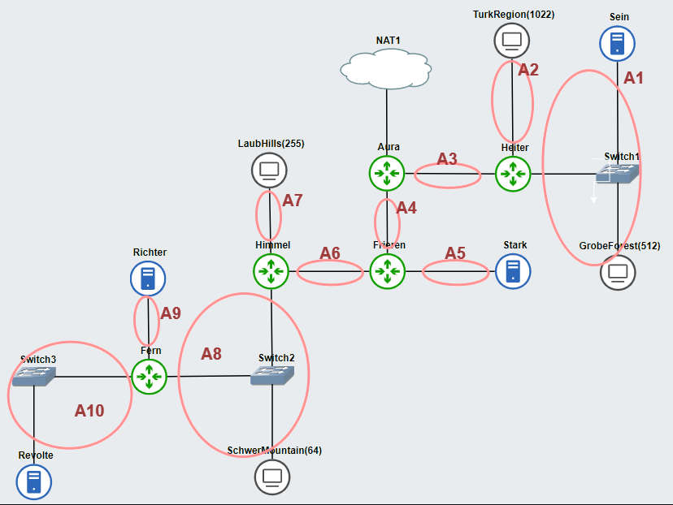

# Jarkom-Modul-4-E18-2023

Anggota Kelompok ''E18'' 
| Nama                                 | NRP        |
|--------------------------------------|------------|
| Hanun Shaka Puspa                    | 5025211051 |
| Cholid Junoto (No contibution)       | 5025201038 |

## Setting Topologi, Subnet, dan Routing
Topologi dan pembagian subnetting kecilnya adalah sebagai berikut:<br/>

<br/>

Untuk subnetting dilakukan dengan VLSM dengan tabel subnet kecil dan netmask sebagai berikut:
<table border="1">
  <tr>
    <th>Subnet</th>
    <th>Jumlah IP</th>
    <th>Netmask</th>
  </tr>
  <tr>
    <td>A1</td>
    <td>514</td>
    <td>/22</td>
  </tr>
  <tr>
    <td>A2</td>
    <td>1023</td>
    <td>/21</td>
  </tr>
  <tr>
    <td>A3</td>
    <td>2</td>
    <td>/30</td>
  </tr>
  <tr>
    <td>A4</td>
    <td>2</td>
    <td>/30</td>
  </tr>
  <tr>
    <td>A5</td>
    <td>2</td>
    <td>/30</td>
  </tr>
  <tr>
    <td>A6</td>
    <td>2</td>
    <td>/30</td>
  </tr>
  <tr>
    <td>A7</td>
    <td>256</td>
    <td>/23</td>
  </tr>
  <tr>
    <td>A8</td>
    <td>66</td>
    <td>/25</td>
  </tr>
  <tr>
    <td>A9</td>
    <td>2</td>
    <td>/30</td>
  </tr>
  <tr>
    <td>A10</td>
    <td>2</td>
    <td>/30</td>
  </tr>
  <tr>
    <td>Jumlah</td>
    <td>1871</td>
    <td>/20</td>
  </tr>
</table>


Kemudian dibagi ip nya ke tiap subnet kecil seperti pohon berikut<br/>
<br/>
Sehingga didapat:<br/>
<table border="1">
  <tr>
    <th>Subnet</th>
    <th>NID</th>
    <th>Broadcast ID</th>
  </tr>
  <tr>
    <td>A1</td>
    <td>192.215.4.0</td>
    <td>192.215.7.255</td>
  </tr>
  <tr>
    <td>A2</td>
    <td>192.215.8.0</td>
    <td>192.215.15.255</td>
  </tr>
  <tr>
    <td>A3</td>
    <td>192.215.0.0</td>
    <td>192.215.0.3</td>
  </tr>
  <tr>
    <td>A4</td>
    <td>192.215.0.4</td>
    <td>192.215.0.7</td>
  </tr>
  <tr>
    <td>A5</td>
    <td>192.215.0.8</td>
    <td>192.215.0.11</td>
  </tr>
  <tr>
    <td>A6</td>
    <td>192.215.0.12</td>
    <td>192.215.0.15</td>
  </tr>
  <tr>
    <td>A7</td>
    <td>192.215.2.0</td>
    <td>192.215.3.255</td>
  </tr>
  <tr>
    <td>A8</td>
    <td>192.215.1.0</td>
    <td>192.215.1.127</td>
  </tr>
  <tr>
    <td>A9</td>
    <td>192.215.0.16</td>
    <td>192.215.0.19</td>
  </tr>
  <tr>
    <td>A10</td>
    <td>192.215.0.20</td>
    <td>192.215.0.23</td>
  </tr>
</table>


Konfigurasi setiap node disetting seperti berikut:

### Aura
```
auto eth0
iface eth0 inet dhcp

auto eth1
iface eth1 inet static
address 192.215.0.1
netmask 255.255.255.252

auto eth2
iface eth2 inet static
address 192.215.0.5
netmask 255.255.255.252
```

### Heiter
```
auto eth0
iface eth0 inet static
address 192.215.0.2
netmask 255.255.255.252
gateway 192.215.0.1

auto eth1
iface eth1 inet static
address 192.215.8.1
netmask 255.255.248.0

auto eth2
iface eth2 inet static
address 192.215.4.1
netmask 255.255.252.0
```

### TurkRegion
```
auto eth0
iface eth0 inet dhcp
gateway 192.215.8.1
```

### Sein
```
auto eth0
iface eth0 inet static
address 192.215.4.2
netmask 255.255.252.0
gateway 192.215.4.1
```

### GrobeForest
```
auto eth0
iface eth0 inet dhcp
gateway 192.215.4.1
```

### Frieren
```
auto eth0
iface eth0 inet static
	address 192.215.0.6
	netmask 255.255.255.252
	gateway 192.215.0.5

auto eth1
iface eth1 inet static
	address 192.215.0.9
	netmask 255.255.255.252

auto eth2
iface eth2 inet static
	address 192.215.0.13
	netmask 255.255.255.252
```

### Stark
```
auto eth0
iface eth0 inet static
address 192.215.0.10
netmask 255.255.255.252
gateway 192.215.0.9
```

### Himmel
```
auto eth0
iface eth0 inet static
address 192.215.0.14
netmask 255.255.255.252
gateway 192.215.0.13

auto eth1
iface eth1 inet static
address 192.215.2.1
netmask 255.255.254.0

auto eth2
iface eth2 inet static
address 192.215.1.1
netmask 255.255.255.128
```

### SchwerMountain
```
auto eth0
iface eth0 inet dhcp
gateway 192.215.1.1
```

### Fern
```
auto eth0
iface eth0 inet static
address 192.215.1.3
netmask 255.255.255.128
gateway 192.215.1.1

auto eth1
iface eth1 inet static
address 192.215.0.17
netmask 255.255.255.252

auto eth2
iface eth2 inet static
address 192.215.0.21
netmask 255.255.255.252
```

### Revolte
```
auto eth0
iface eth0 inet static
address 192.215.0.22
netmask 255.255.255.252
gateway 192.215.0.21
```

### Richter
```
auto eth0
iface eth0 inet static
address 192.215.0.18
netmask 255.255.255.252
gateway 192.215.0.17
```

### LaubHills
```
auto eth0
iface eth0 inet dhcp
gateway 192.215.2.1
```

Dan konfigurasi routing sebagai berikut:
### Fern
```
route add -net 0.0.0.0 netmask 0.0.0.0 gw 192.215.1.1
```

### Himmel
```
route add -net 192.215.0.16 netmask 255.255.255.252 gw 192.215.1.3
route add -net 192.215.0.20 netmask 255.255.255.252 gw 192.215.1.3
```

### Frieren
```
route add -net 192.215.2.0 netmask 255.255.254.0 gw 192.215.0.14
route add -net 192.215.1.0 netmask 255.255.255.128 gw 192.215.0.14
route add -net 192.215.0.16 netmask 255.255.255.252 gw 192.215.0.14
route add -net 192.215.0.20 netmask 255.255.255.252 gw 192.215.0.14
```

### Heiter
```
route add -net 0.0.0.0 netmask 0.0.0.0 gw 192.215.0.1
```

### Aura
```
route add -net 192.215.4.0 netmask 255.255.252.0 gw 192.215.0.2
route add -net 192.215.8.0 netmask 255.255.248.0 gw 192.215.0.2

route add -net 192.215.0.8 netmask 255.255.255.252 gw 192.215.0.6
route add -net 192.215.0.12 netmask 255.255.255.252 gw 192.215.0.6
route add -net 192.215.2.0 netmask 255.255.254.0 gw 192.215.0.6
route add -net 192.215.1.0 netmask 255.255.255.128 gw 192.215.0.6
route add -net 192.215.0.16 netmask 255.255.255.252 gw 192.215.0.6
route add -net 192.215.0.20 netmask 255.255.255.252 gw 192.215.0.6
```

Supaya semua node dapat mengakses internet, dilakukan iptables pada node Aura
```
eth0_ip=$(ip -4 addr show eth0 | grep -oP '(?<=inet\s)\d+(\.\d+){3}')

iptables -t nat -A POSTROUTING -o eth0 -j SNAT --to-source $eth0_ip
```

## Konfigurasi DHCP
Untuk melakukan set-up DHCP, dilakukan beberapa langkah berikut :
1. Install DHCP dan arahkan servernya ke IP Revolte pada setiap router. Disetting juga interfacesnya sebagai `eth0 eth1 eth2` karena semua router menggunakan hingga eth kedua. Router-router tersebut bertindak sebagai relay.
```
apt-get update
apt-get install isc-dhcp-relay -y
service isc-dhcp-relay start

echo '
SERVERS="192.215.0.22"
INTERFACES="eth0 eth1 eth2"
OPTIONS=
' > /etc/default/isc-dhcp-relay

echo '
net.ipv4.ip_forward=1
' > /etc/sysctl.conf

service isc-dhcp-relay restart
```
Pada DHCP Server, dilakukan instalasi dhcp dan setting interface nya.
```
apt-get update
apt install isc-dhcp-server -y

echo '
INTERFACESv4="eth0"
INTERFACESv6=
' > /etc/default/isc-dhcp-server
```

Kemudian, setiap subnet pada topologi dikonfigurasikan pada dhcp.
```
echo '
#A1
subnet 192.215.4.0 netmask 255.255.252.0 {
    range 192.215.4.2 192.215.7.254;
    option routers 192.215.4.1;
    option broadcast-address 192.215.7.255;
    option domain-name-servers 192.215.0.18;
    default-lease-time 180;
    max-lease-time 5760;
}

#A2
subnet 192.215.8.0 netmask 255.255.248.0 {
    range 192.215.8.2 192.215.15.254;
    option routers 192.215.8.1;
    option broadcast-address 192.215.15.255;
    option domain-name-servers 192.215.0.18;
    default-lease-time 180;
    max-lease-time 5760;
}

#A3
subnet 192.215.0.0 netmask 255.255.255.252 {
}

#A4
subnet 192.215.0.4 netmask 255.255.255.252 {
}

#A5
subnet 192.215.0.8 netmask 255.255.255.252 {
}

#A6
subnet 192.215.0.12 netmask 255.255.255.252 {
}

#A7
subnet 192.215.2.0 netmask 255.255.254.0 {
    range 192.215.2.2 192.215.3.254;
    option routers 192.215.2.1;
    option broadcast-address 192.215.3.255;
    option domain-name-servers 192.215.0.18;
    default-lease-time 180;
    max-lease-time 5760;
}

#A8
subnet 192.215.1.0 netmask 255.255.255.128 {
    range 192.215.1.2 192.215.1.126;
    option routers 192.215.1.1;
    option broadcast-address 192.215.1.127;
    option domain-name-servers 192.215.0.18;
    default-lease-time 180;
    max-lease-time 5760;
}

#A9
subnet 192.215.0.16 netmask 255.255.255.252 {
}

#A10
subnet 192.215.0.20 netmask 255.255.255.252 {
}
' > /etc/dhcp/dhcpd.conf
```
Kemudian restart service dhcp
```
service isc-dhcp-server restart
service isc-dhcp-server status
```

## DNS Server Setup
Pada DNS server, dilakukan instalasi bind9
```
apt-get update
apt install bind9 netcat -y
```
Lalu dilakukan konfigurasi DNS-nya dan direstart service bind9-nya.
```
echo '
options {
  directory "/var/cache/bind";
  forwarders {
    192.168.122.1;
  };
  allow-query {any;};
  auth-nxdomain no;
  listen-on-v6 {any;};
};' > /etc/bind/named.conf.options 

service bind9 stop
service bind9 start
```
## Web Server Setup
Pada Web Server, dilakukan instalasi nginx kemudian distart.
```
apt-get update
apt-get install nginx -y
service nginx start
```

## Penyelesaian Soal-Soal Berikutnya
### SOAL 1
Soal : Agar topologi yang kalian buat dapat mengakses keluar, kalian diminta untuk mengkonfigurasi Aura menggunakan iptables, tetapi tidak ingin menggunakan MASQUERADE.

Solusi :
```
eth0_ip=$(ip -4 addr show eth0 | grep -oP '(?<=inet\s)\d+(\.\d+){3}')
iptables -t nat -A POSTROUTING -o eth0 -j SNAT --to-source $eth0_ip
```

Baris pertama command tersebut mengambil semua ip yang terhubung dari Aura melalui eth0, kemudian juga mengambil semua ip outputnya, dalam hal ini yang melalui eth1 dan eth2. Beris kedua menambahkan rule, lebih tepatnya POSTROUTING yang digunakan supaya device dari eth1 dan eth2 dapat melalui eth0. Dapat dites dengan melakukan ping google :
```
ping google.com
```
Pada node-node lain.

### SOAL 2
Soal : Kalian diminta untuk melakukan drop semua TCP dan UDP kecuali port 8080 pada TCP.

Solusi :
Sebelumnya untuk nantinya melakukan testing, pada DHCP server diinstall netcat.
```
apt-get update
apt-get install netcat -y
```
Kemudian pada DHCP server, dilakukan konfigurasi sebagai berikut :
```
iptables -A INPUT -p tcp --dport 8080 -j ACCEPT
iptables -A INPUT -p tcp -j DROP
iptables -A INPUT -p udp -j DROP
```
Baris pertama merupakan rule untuk menerima koneksi TCP dengan port 8080. Jika baris ini telah terpenuhi, maka dua baris berikutnya akan diabaikan. Sementara jika baris pertama tidak terpenuhi, maka akan dilanjutkan dengan memeriksa jenis koneksi, jika TCP atau UDP maka akan di-drop. 

Untuk melakukan testing, pada DHCP Server dapat diinput command:
```
nc -zv localhost 8080
```
Untuk command tersebut tidak akan memberikan output apapun, pertanda koneksi terhubung. Namun, jika koneksi udp atau portnya selain 8080 seperti berikut :
```
nc -z -u -v localhost 5678
```
Setelah beberapa saat akan diterima pesan seperti berikut :
```
root@Revolte:/# nc -z -u -v localhost 5678
localhost [127.0.0.1] 5678 (?) open
```
Pertanda koneksi terblokir.

### SOAL 3 
Soal : Kepala Suku North Area meminta kalian untuk membatasi DHCP dan DNS Server hanya dapat dilakukan ping oleh maksimal 3 device secara bersamaan, selebihnya akan di drop.

Solusi :
Pada DHCP, dipanggil command berikut :
```
iptables -A INPUT -p icmp -m connlimit --connlimit-above 3 --connlimit-mask 0 -j DROP
iptables -A INPUT -m state --state ESTABLISHED,RELATED -j ACCEPT
```
Baris kedua memprioritaskan koneksi yang sudah terhubung untuk tetap terhubung. Baris pertama akan mengakibatkan drop pada koneksi yang hendak dicapai jika sudah ada 3 koneksi yang terhubung. Untuk melakukan testing, dapat dilakukan dengan memanggil command ping :
```
ping 192.215.0.22
```
Dari 4 node berbeda. Pada node ke-4 seharusnya ping tidak dapat memberikan output seperti 3 node pertama.

### SOAL 4
Soal : Lakukan pembatasan sehingga koneksi SSH pada Web Server hanya dapat dilakukan oleh masyarakat yang berada pada GrobeForest.

Solusi :
Melakukan instalasi service ssh pada webserver:
```
apt-get update
apt-get install openssh-server -y
service ssh start
```
Untuk mendapatkan ip tepat pada GrobeForest, dapat dicek menggunakan command `ifconfig` dan diambil nilai ipv4 eth0 nya. Kemudian pada node web server, dipanggil :
```
iptables -A INPUT -p tcp --dport 22 -s ${ipGrobeForest} -j ACCEPT
iptables -A INPUT -p tcp --dport 22 -j DROP
```
Install netcat dan ssh-client pada client
```
apt-get update
apt-get install netcat -y
apt-get install openssh-client -y
```
Lalu dapat dites dengan memanggil command: 
```
nc -vn ${ip webserver} 22
```
Karena ingin melakukan koneksi ssh, maka digunakan port 22. Contoh saat berhasil melakukan koneksi SSH dari GrobeForest adalah :
```
root@GrobeForest: /root@GrobeForest:/# nc -vn 192.215.0.10 22
(UNKNOWN) [192.215.0.10] 22 (ssh) open
SSH-2.0-OpenSSH_7.6p1 Ubuntu-4ubuntu0.7
```
Jika tidak berhasil melakukan koneksi SSH, tidak akan mendapatkan banner versi SSH seperti di atas.

### SOAL 5
Soal : Selain itu, akses menuju WebServer hanya diperbolehkan saat jam kerja yaitu Senin-Jumat pada pukul 08.00-16.00.

Solusi :
Tambahkan rules berikut :
```
iptables -A INPUT -m time --timestart 08:00 --timestop 16:00 --weekdays Mon,Tue,Wed,Thu,Fri -j ACCEPT
iptables -A INPUT -j REJECT
```
Untuk mengetesnya dapat dilakukan dengan melakukan ping dari node lain.

### SOAL 6
Soal : Lalu, karena ternyata terdapat beberapa waktu di mana network administrator dari WebServer tidak bisa stand by, sehingga perlu ditambahkan rule bahwa akses pada hari Senin - Kamis pada jam 12.00 - 13.00 dilarang (istirahat maksi cuy) dan akses di hari Jumat pada jam 11.00 - 13.00 juga dilarang (maklum, Jumatan rek).

Solusi :
Karena rules pada iptables bersifat "order-sensitive", maka rules pada soal sebelumnya perlu dihapus terlebih dahulu. Untuk melihat semua rules pada iptables, dapat dipanggil command: 
```
iptables -L -n -v
```
Lalu hapus rules yang sudah ada dengan memanggil:
```
iptables -D INPUT 1
```
Beberapa kali sesuai jumlah rules yang ada. Kemudian, atur lagi urutannya sehingga menjadi seperti berikut :
```
iptables -A INPUT -p tcp --dport 22 -s ${ipGrobeForest} -j ACCEPT
iptables -A INPUT -p tcp --dport 22 -j DROP

iptables -A INPUT -m time --timestart 12:00 --timestop 13:00 --weekdays Mon,Tue,Wed,Thu -j REJECT
iptables -A INPUT -m time --timestart 11:00 --timestop 13:00 --weekdays Fri -j REJECT
iptables -A INPUT -m time --timestart 08:00 --timestop 16:00 --weekdays Mon,Tue,Wed,Thu,Fri -j ACCEPT
iptables -A INPUT -j REJECT
```
Untuk mengetesnya dapat dilakukan dengan melakukan cara yang sama seperti persoalan sebelumnya. Time pada node-node dalam topologi dapat dicek menggunakan command :
```
date
```
Untuk keperluan testing, waktu pada webserver dapat dimanipulasi dengan command :
```
date +%T -s "19:00:00"
```
Command tersebut mengubah waktu menjadi pukul 19:00 sehingga webserver seharusnya tidak akan bisa diakses.
```
date +%T -s "14:00:00"
```
Command tersebut mengubah waktu menjadi pukul 14:00 sehingga webserver seharusnya bisa diakses.

### SOAL 7
Soal : Karena terdapat 2 WebServer, kalian diminta agar setiap client yang mengakses Sein dengan Port 80 akan didistribusikan secara bergantian pada Sein dan Stark secara berurutan dan request dari client yang mengakses Stark dengan port 443 akan didistribusikan secara bergantian pada Sein dan Stark secara berurutan.

Solusi :
Pada kedua webserver, perlu dilakukan konfigurasi supaya nginx melakukan listen pada port 80 dan 443 :
```
echo 'server {
    listen 80 default_server;
    listen [::]:80 default_server;

    listen 443;
    listen [::]:443;

    server_name _;

    root /var/www/html;
    index index.html;

    location / {
        try_files $uri $uri/ =404;
    }
}
' > etc/nginx/sites-available/default
```
Lalu konfigurasikan page html-nya. Untuk Stark :
```
echo 'Stark' > /var/www/html/index.html
```
Dan untuk Sein :
```
echo 'Sein' > /var/www/html/index.html
```
Restart server nginx :
```
service nginx restart
```
Kemudian tambahkan rules pada Stark dan Sein :
```
iptables -A PREROUTING -t nat -p tcp --dport 80 -d 192.215.4.2 -m statistic --mode nth --every 2 --packet 0 -j DNAT --to-destination 192.215.4.2
iptables -A PREROUTING -t nat -p tcp --dport 80 -d 192.215.4.2 -j DNAT --to-destination 192.215.0.10
iptables -A PREROUTING -t nat -p tcp --dport 443 -d 192.215.0.10 -m statistic --mode nth --every 2 --packet 0 -j DNAT --to-destination 192.215.4.2
iptables -A PREROUTING -t nat -p tcp --dport 443 -d 192.215.0.10 -j DNAT --to-destination 192.215.0.10
```

### SOAL 8
Soal : Karena berbeda koalisi politik, maka subnet dengan masyarakat yang berada pada Revolte dilarang keras mengakses WebServer hingga masa pencoblosan pemilu kepala suku 2024 berakhir. Masa pemilu (hingga pemungutan dan penghitungan suara selesai) kepala suku bersamaan dengan masa pemilu Presiden dan Wakil Presiden Indonesia 2024.

Solusi :
Pada webserver, diberikan rule baru berikut :
```
iptables -A INPUT -p tcp --dport 80 -s 192.215.0.20/30 -m time --datestart 2023-12-19 --datestop 2024-02-15 -j DROP
```
Jika digabungkan dengan rules yang sudah ada dari nomor-nomor sebelumnya, maka menjadi:
```
iptables -A INPUT -p tcp --dport 80 -s 192.215.0.20/30 -m time --datestart 2023-12-19 --datestop 2024-02-15 -j DROP

iptables -A INPUT -p tcp --dport 22 -s ${ipGrobeForest} -j ACCEPT
iptables -A INPUT -p tcp --dport 22 -j DROP

iptables -A INPUT -m time --timestart 12:00 --timestop 13:00 --weekdays Mon,Tue,Wed,Thu -j REJECT
iptables -A INPUT -m time --timestart 11:00 --timestop 13:00 --weekdays Fri -j REJECT
iptables -A INPUT -m time --timestart 08:00 --timestop 16:00 --weekdays Mon,Tue,Wed,Thu,Fri -j ACCEPT
iptables -A INPUT -j REJECT
```
Untuk melakukan testing untuk 14 Februari 2024, dapat menggunakan command berikut pada webserver :
```
date 021414002024
```
Testing ping dari Revolte tidak akan berhasil, atau jika menggunakan nmap akan menjadi :
```
root@Revolte: /root@Revolte:/# nmap 192.215.0.10

Starting Nmap 7.60 ( https://nmap.org ) at 2024-02-14 14:04 UTC
Stats: 0:00:00 elapsed; 0 hosts completed (0 up), 1 undergoing Ping Scan
Ping Scan Timing: About 100.00% done; ETC: 14:04 (0:00:00 remaining)
Nmap scan report for 192.215.0.10
Host is up (0.0018s latency).
Not shown: 998 closed ports
PORT    STATE    SERVICE
80/tcp  filtered http
443/tcp open     https

Nmap done: 1 IP address (1 host up) scanned in 5.68 seconds
```
Sekarang jika dicoba dengan tanggal 20 Februari 2024
```
date 022014002024
```
Ping akan berhasil, dan jika menggunakan nmap akan didapat hasil sebagai berikut
```
root@Revolte: /root@Revolte:/# nmap 192.215.0.10

Starting Nmap 7.60 ( https://nmap.org ) at 2024-02-20 14:00 UTC
Stats: 0:00:00 elapsed; 0 hosts completed (0 up), 1 undergoing Ping Scan
Ping Scan Timing: About 100.00% done; ETC: 14:00 (0:00:00 remaining)
Nmap scan report for 192.215.0.10
Host is up (0.0037s latency).
Not shown: 998 closed ports
PORT    STATE SERVICE
80/tcp  open  http
443/tcp open  https

Nmap done: 1 IP address (1 host up) scanned in 3.17 seconds
```

### SOAL 9
Soal : Sadar akan adanya potensial saling serang antar kubu politik, maka WebServer harus dapat secara otomatis memblokir  alamat IP yang melakukan scanning port dalam jumlah banyak (maksimal 20 scan port) di dalam selang waktu 10 menit. 
(clue: test dengan nmap)

Solusi :
Untuk menetapkan batasan port scanning web server, dapat dilakukan dengan membuat chain baru port scan :
```
iptables -N portscan
```
Kemudian, buat setting untuk drop paket yang di atas 20
```
iptables -A INPUT -m recent --name portscan --update --seconds 600 --hitcount 20 -j DROP
iptables -A FORWARD -m recent --name portscan --update --seconds 600 --hitcount 20 -j DROP
```
Untuk paket sebelum hitcount 20, terima paketnya
```
iptables -A INPUT -m recent --name portscan --set -j ACCEPT
iptables -A FORWARD -m recent --name portscan --set -j ACCEPT
```
Untuk testing menggunakan nmap, command berikut dapat dipanggil dari node lain
```
nmap --send-eth -p 25 192.215.0.10
```
Hasilnya akan seperti berikut :
```
root@LaubHills: /root@LaubHills:/# nmap --send-eth -p 25 192.215.0.10

Starting Nmap 7.60 ( https://nmap.org ) at 2024-02-20 14:29 UTC
Stats: 0:00:00 elapsed; 0 hosts completed (0 up), 1 undergoing Ping Scan
Ping Scan Timing: About 100.00% done; ETC: 14:29 (0:00:00 remaining)
Nmap scan report for 192.215.0.10
Host is up (0.00022s latency).

PORT   STATE  SERVICE
25/tcp closed smtp

Nmap done: 1 IP address (1 host up) scanned in 0.56 seconds
```

### SOAL 10
Soal : Karena kepala suku ingin tau paket apa saja yang di-drop, maka di setiap node server dan router ditambahkan logging paket yang di-drop dengan standard syslog level. 

Solusi :
Untuk memodifikasi rules yang sudah dibuat, rules yang sudah ada dapat dihapus dulu, atau bisa langsung clear semua rules dengan :
```
iptables -F
```
Kemudian, tambahkan LOG pada command pada nomor 9 sehingga menjadi :
```
iptables -I INPUT -m recent --name portscan --update --seconds 600 --hitcount 20 -j LOG --log-prefix "Portscan detected: "
iptables -I FORWARD -m recent --name portscan --update --seconds 600 --hitcount 20 -j LOG --log-prefix "Portscan detected: "

iptables -A INPUT -m recent --name portscan --set -j ACCEPT
iptables -A FORWARD -m recent --name portscan --set -j ACCEPT
```
Buat log filenya
```
touch /var/log/syslog
```